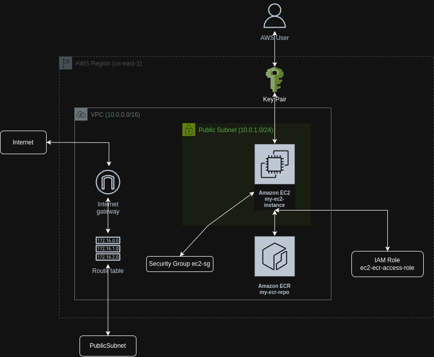

# test_devops


El código dentro de `/app/server.js` crea un servidor web sencillo con Node.js y Express que expone un endpoint `/api/insurance`. Este endpoint realiza una petición a la API externa `https://dn8mlk7hdujby.cloudfront.net/interview/insurance/58` para obtener información sobre un seguro y la devuelve al cliente en formato JSON.

- Endpoint del backend funcionando en el EC2: `http://3.239.248.172:3000/api/insurance` *** Actualmente dado de baja ***
- La respuesta json que se obtiene es la siguiente:
```JSON
{
  "insurance": {
    "name": "Seguro Vida Activa",
    "description": "Con nuestro Seguro Vida Activa podrás disfrutar el día a día con tranquilidad, gracias al respaldo y apoyo frente a las consecuencias de eventuales accidentes que puedas sufrir. Posee excelente cobertura, un precio muy conveniente y, en caso de fallecimiento, apoyo financiero para tus seres queridos con un capital asegurado.",
    "price": "9000",
    "image": "https://ventaenlinea.bicevida.cl/pub/media/catalog/product/cache/69eb2560c3d44c78f7327201dc5a282b/i/m/img-01.jpg"
  }
}
```

## Pipeline
Este pipeline automatiza la integración continua y el despliegue continuo de la aplicación. Cada vez que se realiza un push a la rama main, se obtiene el codigo, se realizan test, se construye la imagen Docker, se sube a ECR y se despliega en una instancia EC2, asegurando que la aplicación en producción esté siempre actualizada con los últimos cambios.  El uso de secretos de GitHub protege información sensible como las credenciales de AWS y la clave privada SSH.

Job: `build-and-deploy`


### Steps

- `Checkout code`: Utiliza la acción actions/checkout@v4 para descargar el código del repositorio al runner. Esto es esencial para que los pasos posteriores puedan acceder a los archivos del proyecto.

- `Setup Node and run tests`: Utiliza la acción actions/setup-node@v4 para configurar el entorno de Node.js en el runner. Especifica la versión 20.17.x.

- `Configure AWS credentials`: Utiliza la acción `aws-actions/configure-aws-credentials@v2`para configurar las credenciales de AWS en el runner. Estas credenciales se almacenan como `secrets` en GitHub y se inyectan de forma segura en el entorno del workflow. Se usan las variables de entorno `AWS_ACCESS_KEY_ID`, `AWS_SECRET_ACCESS_KEY` y `AWS_DEFAULT_REGION`.

- `Login to Amazon ECR`: Utiliza la acción `aws-actions/amazon-ecr-login@v2` para autenticar el runner con Amazon Elastic Container Registry (ECR). Esto permite que el runner pueda subir la imagen Docker construida.

- `Build Docker image`: Construye la imagen Docker de la aplicación. Utiliza el comando docker build y etiqueta la imagen con la URL del repositorio ECR `(${{ secrets.ECR_REPOSITORY_URL }})` y la etiqueta latest.

- `Push Docker image`: Sube la imagen Docker construida al repositorio ECR. Primero, se etiqueta la imagen localmente con la misma URL y etiqueta, y luego se usa docker push para subirla.

- `Deploy to EC2`:Este paso realiza el despliegue en la instancia EC2.
  - Se define la variable de entorno `SSH_PRIVATE_KEY` con la clave privada SSH (también almacenada como secreto en GitHub).
  - Se utiliza ssh para conectar a la instancia EC2 `(ec2-user@${{ secrets.EC2_PUBLIC_IP }})`.
  - Dentro del comando SSH, se ejecutan las siguientes acciones en la instancia EC2:
    - Se agrega el usuario `ec2-user` al grupo docker y se recargan los grupos para que los cambios surtan efecto. Esto permite que el usuario ejecute comandos de Docker sin sudo.
    - Se autentica con ECR usando `aws ecr get-login-password`.
    - Se detienen y eliminan los contenedores Docker existentes (si los hay) para asegurar una actualización limpia.
    - Se descarga la nueva imagen Docker desde ECR usando `docker pull`.
    - Se ejecuta la nueva imagen Docker en un contenedor, mapeando el puerto 3000 del contenedor al puerto 3000 de la instancia EC2 (`-p 3000:3000`). El flag `-d` ejecuta el contenedor en segundo plano (`detached mode`).


## IaC ( Terraform - AWS )



Ubicado en la carpeta `/iac`, este módulo de Terraform crea una infraestructura básica en AWS con enfoque en utilizar la **capa gratuita** o **Free Tier**. Los servicios que incluye son: una VPC, una subred pública, una instancia EC2 y un repositorio ECR. La instancia EC2 está configurada para ejecutar Docker y tiene acceso a ECR. Esta infraestructura es ideal para desplegar aplicaciones en contenedores en AWS.

**Recursos:**

- VPC: Una Virtual Private Cloud (VPC) con un rango CIDR de `10.0.0.0/16`.

- Subred Pública: Una subred pública (`10.0.1.0/24`) en la zona de disponibilidad us-east-1a con asignación automática de IPs públicas.

- Internet Gateway: Un Internet Gateway para permitir la comunicación entre la VPC y el internet.

- Tabla de Rutas: Una tabla de rutas que dirige el tráfico de la subred pública hacia el Internet Gateway.

- Grupo de Seguridad: Un grupo de seguridad llamado `ec2-sg` que permite el tráfico entrante en los puertos `3000`(para aplicaciones) y `22` (SSH) desde cualquier IP `(0.0.0.0/0)`. Permite todo el tráfico saliente.

- Par de Llaves Un par de llaves SSH llamado `my-ec2-key`para acceder a la instancia EC2. NOTA: Se asume que la clave pública está en ~/.ssh/aws-ec2-key.pub. Debes crear tu propia clave y actualizar la ruta si es necesario.

- Rol IAM: Un rol IAM llamado `ec2-ecr-access-role` que permite a la instancia EC2 asumir el rol y realizar acciones.

- Política IAM: Una política adjunta al rol que otorga permisos `AmazonEC2ContainerRegistryPowerUser` para interactuar con Amazon ECR.

P- erfil de Instancia: Un perfil de instancia IAM llamado `ec2-ecr-instance-profile` que asocia el rol con la instancia EC2.

- Instancia EC2: Una instancia `EC2` con las siguientes características:

  - AMI: `ami-0c02fb55956c7d316` (Amazon Linux 2). Puedes cambiarla en `variables.tf`.

  - Tipo de instancia: `t2.micro`. Puedes cambiarla en `variables.tf`.

  - Grupo de seguridad: `ec2-sg`.

  - Subred: La subred pública creada.

  - Perfil de instancia: `ec2-ecr-instance-profile`.

  - Par de llaves: `my-ec2-key`.

  - user_data: Un script que se ejecuta al iniciar la instancia para instalar y configurar Docker.

  - Tag: Name: `my-ec2-instance`.

- Repositorio ECR: Un repositorio ECR llamado `my-ecr-repo` para almacenar imágenes Docker.

**Archivos de Terraform:**

- `main.tf`: Contiene la definición de todos los recursos de la infraestructura.

- `outputs.tf`: Define las salidas del proyecto, incluyendo la URL del repositorio ECR y la IP pública de la instancia EC2.

- `providers.tf`: Configura el proveedor de AWS y especifica la región `us-east-1`.

- `variables.tf`: Define las variables utilizadas en el proyecto, permitiendo personalizar la región, el nombre del repositorio ECR, el tipo de instancia y la AMI.


**Variables:**

| Variable               | Descripción                             | Valor por defecto      |
| ---------------------- | --------------------------------------- | ---------------------- |
| `aws_region`           | Región de AWS                          | `us-east-1`             |
| `ecr_repository_name` | Nombre del repositorio ECR             | `my-ecr-devops-test` |
| `ec2_instance_type`    | Tipo de instancia EC2                  | `t2.micro`             |
| `ec2_ami_id`           | ID de la AMI                           | `ami-0c02fb55956c7d316` |

**Outputs:**

| Output                  | Descripción                                           |
| ----------------------- | ----------------------------------------------------- |
| `ecr_repository_url`    | URL del repositorio ECR                              |
| `ec2_instance_public_ip` | Dirección IP pública de la instancia EC2              |

**Uso:**

1. **Requisitos:**
    *   Tener una cuenta de AWS.
    *   Instalar Terraform.
    *   Configurar las credenciales de AWS (por ejemplo, mediante variables de entorno, perfil de AWS CLI o rol de IAM).
    *   Crear un par de llaves SSH y ubicar la clave pública en `~/.ssh/aws-ec2-key.pub` o modificar la ruta en el archivo `main.tf`.

2. **Inicializar Terraform:**

    ```bash
    terraform init
    ```

3. **Planificar la infraestructura:**

    ```bash
    terraform plan
    ```

4. **Aplicar la configuración:**

    ```bash
    terraform apply
    ```

5. **Destruir la infraestructura:**

    ```bash
    terraform destroy
    ```

**Acceso a la instancia:**

Una vez que la infraestructura esté creada, puedes acceder a la instancia EC2 mediante SSH utilizando la IP pública que se muestra en la salida `ec2_instance_public_ip` y la clave privada asociada al par de llaves `my-ec2-key`:

```bash
ssh -i ~/.ssh/aws-ec2-key ec2-user@<ec2_instance_public_ip>
```

**Consideraciones:**

*   El script `user_data` instala y configura Docker en la instancia EC2. Asegúrate de que esto cumple con tus necesidades y considera la posibilidad de utilizar una imagen de Docker personalizada si es necesario.

---


## Flujo Git
El flujo git utilizado es una versión modificada de GitFlow. Consta de las siguientes ramas `main`, `develop`, `feature/*`, `fix/*`, `add/*`.

- `main`: Contiene el código listo para producción.

- `develop`: La rama de integración principal para todas las nuevas funcionalidades.

- `feature/*`: Se ramifica desde main, es donde desarrollan las nuevas features.

- `fix/*`: Se ramifica desde develop, es donde se solucionan problemas de codigo u otros.

Los cambios de `develop` se fusionan directamente en `main` cuando están listos para el despliegue.

En lugar de que todas las funcionalidades se fusionen directamente en `main`, primero se fusionan los `features` los `fix` y `otros` en `develop`. Luego, una fusión controlada de `develop` a `main` activa el pipeline para el despliegue.

